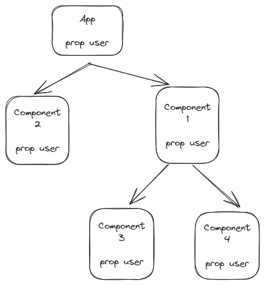

# Provider Pattern React

Its a design pattern that allow us to share or make data available throught multiple component layers.

In some cases, we want or we need to share data to multiple/all child components. Although we can pass data to components using props, but this can be dificult when we start pasing data throught multiple component levels, because it will start a problem that its know **props drilling**




In the previus schema, if we want to share the user prop from Component1 to Component 4, we need to pass the user prop throught all the component tree, now imagine if we have 5 layers of component or more, now add to that problem the fact that we want to pass more that one prop. It will become a hell. And refactoring the code could be a big problem because we don't know where the data comes from.


In code a prop drilling problem could be something like the previus schema, when we have an app that has a property data, and we need to render something in the `<Text />` component that is in the data property, so we start passing props far down the component layers. If in the future for example we want to rename the prop we have to rename all the props in the different layers, so the bigger your application gets, the trickier prop drilling can be.

The ideal case could be avoiding some component layers that didn't need the props. We need something that allow us accessing the data prop without relying on prop drilling, here is where **Provider Patter** can help us.

With the provider pattern we can make data available througth multiple components. Rather than passing that data down each layer through props, we can wrap all component in a **Provider** 

##### Provider:
It's a higher order component (HOC) provided to us by the Context object. We can create a Context object, using the createContext method that React provides for us.

The Provider receives a value prop, which contains the data that we want to pass down. All components that are wrapped within this provider have access to the value of the value prop.


With the provider, only the components that are in red text are using the data, the difference is that is being consumed directly from the provider and not passed throught the props

## Consume a context

To consume a context we have the normal way that is using the `useContext` hook

```
  export default function Component1() {
    const { theme, toggleTheme } = useContext(ThemeContext)
    return (
      <div> 
        hello
      </div>
    )
  }
```

But we can use other way that is using a custom hook that return us the value of 
the provider, and we can add a validation that is used within the ThemeProvider:

```
  export default function useThemeContext() {
    const theme = useContext(ThemeContext) 
    if (!theme) {
      throw new Error('useThemeContext must be used within ThemeProvider')
    }
    return theme
  }

```

## USE CASES

1 - Share global data like a theme UI state, session
